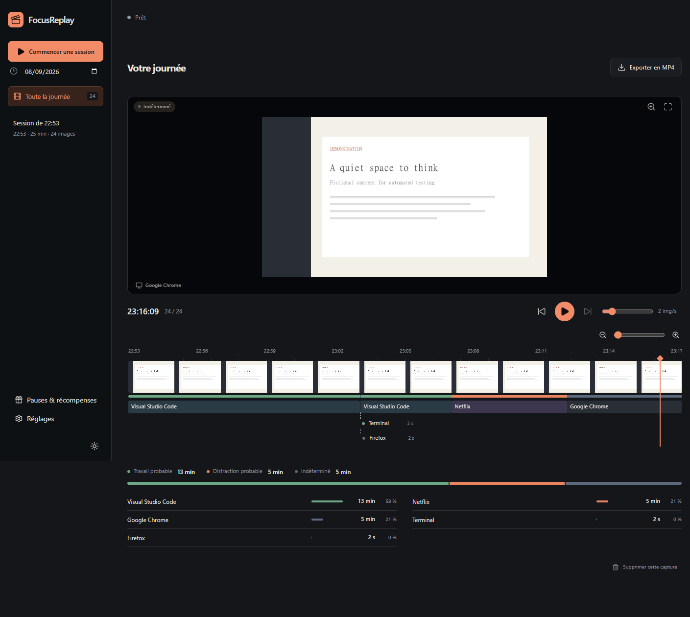

# FocusReplay

**Start. Work. Rewind.** A private Windows app that makes your workday visible through periodic screenshots and foreground application history. No goals to type; optional check-ins help explain interruptions. No account required for recording.



## What it does

- **One-click sessions:** automatic names, start/pause/resume/stop, tray controls and an optional floating mini-bar.
- **Real pauses:** 2, 5, 10 or 15 minutes, a custom duration, or an indefinite pause. Timed pauses end with a chime and notification; recording only resumes when you ask. Ending a session cancels its pause alarm.
- **Two independent records:** screenshots every 10 seconds to 10 minutes; foreground application estimates every 2 seconds.
- **Interactive replay:** drag the timeline for immediate preview, step with Q/D or the arrow keys, press Space to play, use the mouse wheel to zoom the timeline and drag sliders for 1–8× zoom or 1–8 images/second, and review while recording continues.
- **Application timeline:** labeled segments link software usage to the nearest preceding screenshot. The summary shows application durations and percentages of observed time.
- **Automatic, cautious categories:** work probable, distraction probable, unknown and idle. Browser hints are processed locally without retaining raw window titles. No AI service or productivity score.
- **Interactive reminders:** answer “Sur quoi tu travailles ?” directly in a Windows notification. “J’ai arrêté de travailler” pauses the session and opens a small reason form. Replies appear as timeline markers and in Repères. An optional floating prompt asks about non-work usage after one minute, at most once every ten minutes. Responses are optional.
- **Soft sound design:** synthesized interaction sounds and reminder chimes, with independent volume and mute. No downloaded sound assets.
- **Start music:** import an independent MP3 for app launch, session intro and the session soundtrack; each track plays once without looping. Optional Spotify music supports app launch, session intro and a session soundtrack.
- **MP4 export:** one click exports the selected day or session in 1080p, at the current playback speed. Large timestamps, software names/durations, category bands and a moving timeline show the context. Explorer reveals the finished video.
- **Bounded storage:** compressed JPEGs, 90-day retention (subject to the storage cap) and 1 GB capture cap by default.
- **Dark and light themes**, plus Windows theme preference.
- **Optional camera photos:** off by default, explicit in-app consent, no microphone. A camera photo accompanies each screenshot and appears in picture-in-picture during replay and optionally in the MP4. Camera access stops during pauses, locking and session end.
- **Optional rewards:** accumulated work minutes unlock custom break/game/movie rewards directly. Each reward states its required work minutes and reward duration. Milestones celebrate 25 minutes, 1, 2, 4 and 8 hours of cumulative eligible work. Normal pauses remain free.

## Run on Windows

Requires Windows 10/11 x64. The interface is in French. A portable build runs without a development environment; building from source requires Node.js 24 LTS and Git.

French walkthrough: [Essayer FocusReplay avec de vraies données](docs/DEMARRER.fr.md).

```powershell
git clone https://github.com/ElieNissen/FocusReplay.git
cd FocusReplay
npm ci
npm exec -- install-electron --no
npm start
```

Dependency installation downloads Electron and the local FFmpeg encoder. Normal application use works offline.

Click **Commencer une session**, then get on with your day. You can review immediately. Close the window to keep recording in the tray, use **Pause** for a private moment, **Terminer** to finish, or the tray's **Quitter** command to exit completely. The app does not silently start with Windows.

For music and capture options, open **Réglages**. Reducing retention or the cap deletes eligible old captures immediately. Export a replay before its captures expire if you want to keep it.

## Build a portable executable

```powershell
npm run dist
```

The build is written to `release/FocusReplay-0.6.0-Windows.exe`. It is unsigned; Windows may show a publisher warning. Signing and a public binary release are not configured. The encoder's third-party notices and source-distribution requirements are documented in [THIRD_PARTY_NOTICES.md](THIRD_PARTY_NOTICES.md).

## What the numbers mean

Foreground time is sampled, not continuous. An app running in the background receives no time. Gaps, pauses and unavailable observations are not counted as work. Five minutes without user input are labeled idle; that can also mean reading or watching a work-related video. Durations are estimates and category names deliberately say **probable**.

Code and office tools are recognized as work-related; selected game launchers and entertainment services as possible distractions. Browsers, messaging, Spotify and YouTube remain ambiguous unless a specific browser hint is recognized. No system can infer your intention from a process name alone.

A screenshot is one instant. Scrubbing between screenshots displays the previous available image with its true timestamp. The application track can show a change that occurred between captures. Protected/DRM surfaces may appear black. The first version captures one selected monitor, not all monitors at once.

Camera photos are taken near each screen capture and have their own timestamps. The camera stream stays open during an enabled session, so the camera light can remain on; only periodic photos are saved. The camera defaults to the Windows default device. Failure to get a camera picture does not stop screen capture. No facial recognition or reliable desk-presence detection is implemented; idle time is keyboard/mouse inactivity, not proof that someone left the desk.

Rewards are disabled by default. Choose how many points one observed hour earns, and whether only probable work or all non-idle observations count. Rates apply going forward; unspent points survive screenshot expiry. Redeeming a reward deducts its cost and pauses recording. A chime and notification mark the planned end, but no recording restarts automatically. This is a personal budgeting aid, not a measure of effort or a restriction on taking breaks.

## Local data and GitHub

Data lives outside the repository, normally in `%APPDATA%/FocusReplay`. Use **Réglages → Ouvrir le dossier local** to find it. MP4 exports stay in the folder you choose. The repository ignores recordings, audio, exports, local profiles and build/test output. Public screenshots in `docs/images/` contain only generated fictional test content.

Advanced: launch with `--focus-data-dir="D:\FocusReplayData"` to choose a separate local profile. Keep that folder private and outside your source repository.

See [SECURITY.md](SECURITY.md) for exact data flow, retention and limitations. Original capture files stay local and are not encrypted by the app. Optional private-profile sharing uploads a reduced, filtered copy. Optional Spotify credentials use Windows encryption.

## Music (Spotify or local MP3)

Three independent switches in **Réglages → Musique**: app launch, session intro and session soundtrack. Each has its own independent imported MP3 or accepts one Spotify track, up to 100 pasted track links (shuffled without duplicates), or a playlist link. The intro completes before the soundtrack begins. Nothing loops. Starting a session interrupts launch music. Pause, lock, stop and Quit stop app-controlled music; resume does not automatically restart it. Use Écouter to play it again.

Spotify setup, once per local profile:

1. A Spotify Premium account is required. Open **Connecter Spotify → Ouvrir Spotify Developers** and create a development app using Web API. Current development-mode apps allow up to five authorized accounts.
2. Register exactly `http://127.0.0.1:43827/callback` as its redirect URI. Copy the **Client ID** (never the Client Secret) into FocusReplay under Configuration personnelle and sign in through Spotify’s browser page. Individual Premium subscribers can create this personal development app.
3. Open Spotify on the PC and play a track once. In FocusReplay, refresh and choose that PC under **Compte et appareil Spotify**. Playback always targets the selected device.
4. Enable the desired phase, choose Spotify and search by track/artist name. Add results to the selection, or choose from Mes playlists. Save. **Écouter** tests that phase. Existing connections must refresh authorization once to grant playlist access.

The Web API controls Spotify Connect; FocusReplay does not download Spotify music or include it in exported videos. Explicit track selections are stopped at the final track boundary to prevent recommendations; network latency may slightly affect that boundary. Playlists use Spotify's own order with repeat and shuffle disabled. Disable Spotify Autoplay to prevent recommended music after a playlist ends. Manually choosing a different song/device relinquishes control and cancels the pending soundtrack. Spotify errors never interrupt capture.

[Spotify playback requirements](https://developer.spotify.com/documentation/web-api/reference/start-a-users-playback) · [Development-mode limits](https://developer.spotify.com/documentation/web-api/tutorials/february-2026-migration-guide)

## Development and verification

```powershell
npm test                 # Lifecycle, recovery, retention, quota, classification, timeline
npm run test:e2e         # Full Electron UI flow using fictional captures and test audio
npm run check:privacy    # Check public files for private artifacts and common secret patterns
npm run build           # Build the renderer
```

`npm run dev` opens the real recorder with live React/CSS updates on a loopback-only development server. Interface edits appear immediately. Changes under `electron/` save and end the current session, then restart the app; you choose when to start recording again. Development recordings live in the separate ignored `work/dev-profile/`, preserving your normal application history. Use `node scripts/test-dev.mjs` to verify hot updates. See [CONTRIBUTING.md](CONTRIBUTING.md) for the development workflow and module boundaries.

E2E profiles are isolated under ignored `work/` directories. `node scripts/smoke-windows.mjs` additionally verifies real Windows capture and foreground tracking in a private temporary profile, then removes the real samples on success. Never publish those test profiles.

After packaging, `node scripts/smoke-windows.mjs --packaged` checks the actual packaged application and its Windows tracking helper. The camera E2E uses a generated color-pattern video as a fake device; it never opens a physical webcam.

Architecture: Electron main process owns capture, lifecycle and filesystem access; React renders the editor; a persistent Windows helper reports only process names and category hints; atomic JSON metadata indexes generated JPEG files; FFmpeg encodes an export from a pinned snapshot. The public IPC surface is defined in `electron/preload.cjs`.

## License

Original FocusReplay code: [MIT](LICENSE). Dependencies and the separate FFmpeg encoder retain their own licenses.

Application classification can be adjusted once per software in **Réglages → Classement des logiciels**. Rules apply to existing observations and future captures; reverting to Automatic restores original detection. Previously earned points are unchanged.

## Domains and timeline rules

Enable **Réglages → Suivi → Reconnaître les sites** to read the foreground browser address bar through Windows UI Automation. Chrome, Edge, Brave, Firefox and Opera are attempted with recognized English/French address-bar identifiers. Availability depends on browser accessibility support and language; unsupported bars produce no domain. Only the normalized domain is stored, never the page path/query, browsing history or page contents. This includes private windows if their address bar is accessible. Turning the option off stops future domain observations; existing records follow normal retention/deletion.

Click a software/site label on the timeline to choose Travail, Loisir, Indéterminé or Automatique. Priority: exact-domain personal rule, application personal rule, known domain heuristic, window-title hint/application heuristic. Rules reclassify existing observations and future captures; previously awarded points do not change. Domain rules are exact: www is normalized away, other subdomains remain separate.

A distributor can set the public clientId in electron/spotify-app.json before building to enable shared Spotify sign-in. The included public Client ID is reserved for the invitation-only FocusReplay test group; personal configuration is the default public setup path. Never put a client secret there. Shared development access still requires allowlisting and is limited by Spotify; personal configuration remains available.

## Distribution and a possible hosted service

Recording, replay, local audio and classification work independently of any account. Spotify remains an optional adapter. Public users can configure their own Premium development app; the shared FocusReplay client is explicitly invitation-only and is not advertised as generally available. A SaaS account/backend would not remove Spotify’s development cap or grant extended-quota eligibility. Any future hosted account should remain separate from provider authorization; refresh credentials must never be shared between users. No hosted accounts, billing or upload service are implemented in this version.

### Check-in behavior

Native inline replies use Electron 44 Windows notifications. A notification click or delivery failure opens the same response form as a protected, always-on-top overlay. Windows notification settings can suppress delivery; use **Réglages → Suivi → Essayer le rappel** during a session to try it. Without native delivery, the overlay remains the fallback.

**Demander pourquoi je quitte le travail** is off by default. It includes both probable leisure and unknown foreground software/sites, excludes idle and FocusReplay itself, waits for one minute of consecutive observed activity and uses a shared ten-minute cooldown. It does not pause automatically. The stop-working button pauses explicitly, without a timer or automatic restart. Check-ins expire after ten minutes and are invalidated on lock, session end or an incompatible pause/resume. Replies (500 characters maximum), prompt/response times and the application/domain are stored with session events and follow the same retention/deletion rules. Dismissals are recorded without text and hidden from Repères. No response is required to continue using the app.

Notification support: [Electron Notification API](https://www.electronjs.org/docs/latest/api/notification). UI tests exercise the fallback overlay and simulated native reply/action events; they do not certify a human reply in the Windows notification center.

### Daily timeline and minute rewards (0.6)

The software lane uses fixed chronological overview blocks. The dominant application/site is labeled with its observed duration; +N lists the remaining applications in the block. Clicking shows every application and its exact accumulated duration, including brief switches. The thin category strip retains proportional timing; a summary block does not claim its dominant app occupied the entire interval. Zoom refines the blocks without stacked labels. Session pauses, locking and time between sessions replace repeated thumbnails with labeled gaps. Native app icons are learned when applications are used; unavailable icons use a generic fallback. Executable paths remain in memory and are never stored in session history.

Rewards now accrue one work minute per eligible observed minute. A reward might exchange 25 work minutes for 5 break minutes. Existing point balances and reward costs migrate once using the last configured points-per-hour rate; costs round up to a whole minute. Subsequent work accrues directly, independently of that legacy rate. Already crossed milestones are marked during migration without replaying notifications.

`npm run test:timeline` generates a fictional ten-hour day with rapid app switches and verifies grouping, pauses, Q/D and thumbnail stability during zoom.

## Private profile (0.7)

Open **Profil**, choose **Connecter mon profil**, and select the private connection JSON supplied by your site operator. Set a viewer password (12–128 characters), review privacy rules, then activate sharing. Nothing uploads before you enable it. Viewers need only your profile URL and viewer password, never the connection file. Stop and remove sharing from this same screen.

Online history progressively thins older images to keep up to 90 days within 800 images (40 MB maximum). Daily totals remain lightweight and independent of screenshots. Local originals default to 90 days, up to one year in Settings, while the 1 GB default cap still applies. Existing three-day defaults migrate to 90 days; other choices stay unchanged. Exports remain outside automatic cleanup.

See [web/README.md](web/README.md) for storage tiers, profile isolation, operational limitations and the social-network roadmap.

## Independent hosting and accounts (0.8)

The recommended connection flow is now **Profil → Créer mon compte / Se connecter**, using your server URL, account identifier and password. New accounts require the server’s invitation code. No connection file is needed. Existing encrypted legacy connections keep working.

Deploy your own server from this repository using [the standalone guide](web/SELF_HOSTING.md). The [social roadmap](docs/SOCIAL_ROADMAP.md) separates accounts, friends and screenshot grants.
